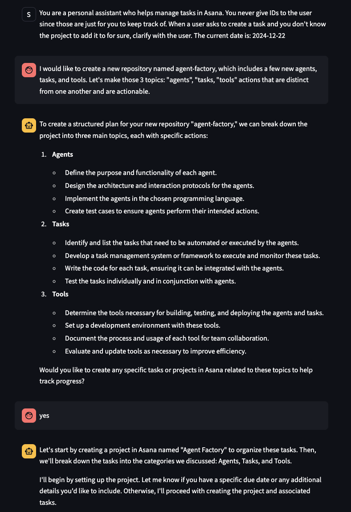

<div>
    <h1>AI Agent Factory</h1>
    <p>Collection of agent creation tools, each of which allows for the creation of distinct types of AI agents. 
    Enabling developers to harness AI agents to revolutionize operations and streamline application production, drawing from successful implementations that align with best practices.</p>
  <!-- <a href="https://www.youtube.com/"> -->
    <div style="margin-top: 25px;margin-bottom:25px">
    <h2>
      Chat Agent Example
    </h2>
      
  <!-- </a> -->
</div>

<p align="center" style="margin-top: 25px">
  <a href="#what-are-ai-agents"><strong>What are AI Agents?</strong></a> ·
  <a href="#usage-instructions"><strong>Usage Instructions</strong></a> ·
</p>
<br/>

## What are AI Agents?
<div align="center" style="margin-top: 25px;margin-bottom:25px">

</div>

At their core, AI agents are Large Language Models (LLMs) enhanced with the capability to engage with external systems.

Their applications are vast - from composing emails and managing CRM appointments to handling task management systems. 

The possibilities are truly limitless, and I'm excited to help you explore the full scope of what's possible!

What makes AI agents particularly remarkable is their ability to deliver powerful results with minimal coding requirements. 

Yet, this simplicity doesn't limit their potential - there's enormous opportunity to develop sophisticated systems 
that orchestrate multiple agents working in harmony to achieve extraordinary outcomes.

This is the exciting journey 
we'll embark on and I'm thrilled to guide you through it!

## Usage Instructions

The below instructions assume you already have Git, Python, and Pip installed. If you do not, you can install
[Python + Pip from here](https://www.python.org/downloads/) and [Git from here](https://git-scm.com/).

First clone this GitHub repository, open up a terminal,
and change your directory to the folder for the current scenario you are watching (example: start with [/tools/pydantic-ai/](/pydantic-ai)).

The below instructions work on any OS - Windows, Linux, or Mac.

You will need to use the environment variables defined in the .env.example file in the folder (example for pydantic-ai: [`pydantic-ai/.env.example`](/tools/pydantic-ai/.env.example)) to set up your API keys and other configuration. Turn the .env.example file into a `.env` file, and supply the necessary environment variables.

After setting up the .env file, run the below commands to create a Python virtual environment and install the necessary Python packages to run the code. 

Creating a virtual environment is optional but recommended. Make sure to run the pip install for each use case.

```bash
python -m venv agent-factory

# On Windows:
.\agent-factory\Scripts\activate

# On MacOS/Linux: 
source agent-factory/bin/activate

cd tools/pydantic-ai (or whichever tool or script)
pip install -r requirements.txt
```

Then, you can execute the code in the folder with:

```bash
python [script name].py
```

## Installation Instructions for `pipx` and `pip`.
- Install pipx: `brew install pipx`
- Install pip: `pipx install pip`