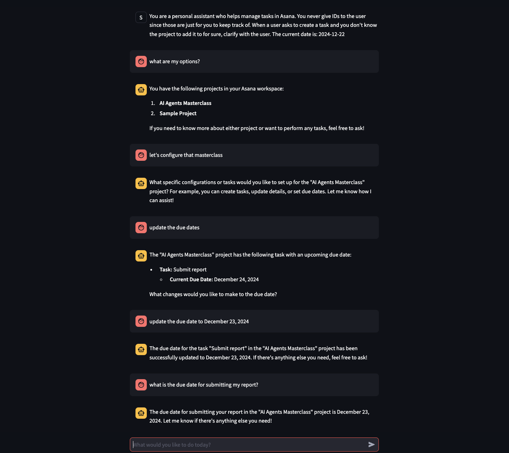

# Asana Task Manager Agent

<html>
  <body>
    
  </body>
</html>

## Prerequisites

- Python 3.11+
- OpenAI API key (if using GPT models)
- [Ollama](https://ollama.ai/) (optional, for local LLM usage)
- Brave Search API key

## Installation

1. **Clone Repository**:

```bash
git clone https://github.com/bunsdev/agent-factory.git
cd agent-factory/agents/asana/manager
```

2. Install dependencies (recommend to do this in a Python virtual environment):

```bash
pip install -r requirements.txt
```

This will install Streamlit, and all of their dependencies.

3. Set up environment variables:
   - Rename `.env.example` to `.env`.
   - Edit `.env` with your API keys and preferences:
   ```env
   OPENAI_API_KEY=your_openai_api_key  # Only needed if using GPT models
   LLM_MODEL=your_chosen_model  # e.g., gpt-4, qwen2.5:32b
   ASANA_ACCESS_TOKEN=your_asana_access_token
   ASANA_WORKPLACE_ID=your_asana_workplace_id
   ```

## Usage

### Command Line Interface

```bash
streamlit run asana-manager-agent.py
```

An example to create an Asana task with subtasks:

```bash
I would like to create a task on Asana named. Let's name the task "agent factory", which includes 3 subtasks. Let's make those subtasks: "agents", "tasks, and "tools".
```

## Configuration

### LLM Models

You can choose between different LLM models by setting the `LLM_MODEL` environment variable:

- For OpenAI GPT (example model, this can be any OpenAI model):

  ```env
  LLM_MODEL=gpt-4o
  ```

- For Ollama (example model, this can be any Ollama model you have downloaded):
  ```env
  LLM_MODEL=qwen2.5:32b
  ```
